# Solidity EVM

[](https://circleci.com/gh/Magicking/solidity-evm/tree/master)
[](https://coveralls.io/github/Magicking/solidity-evm?branch=master)

Solidity EVM is a restricted Ethereum Virtual Machine interpreter, it
interprets only `pure` (and exceptions) solidity-wise EVM bytecode otherwise this implementation
should throw an invalid opcode.

## Idea

The goal is to allow a smart contract to analyze an other smart contract and
detect if it would be allowed to run a function to force the suicide(address)
opcode.

```javascript
//Landlord.sol deployed @ 0xc8f8371BDd6FB64388F0D65F43A0040926Ee38be
contract Landlord {
	modifier canDestruct() {
		...
		evm.RunAtAddress(msg.sender, 0x2be5e0b2); // _eviction() function selector
		// check if `suicide exception` with returning address properly set
		...
	}

	function Register() canDestruct {
		// Register to oracle for service
	}
}

//Tenant.sol deployed @ 0x832658CEcFC4fb19661C3B8Bbd04A3A3720efe1e
contract Tenant {
	address TenantOwner;

	constructor(address owner) {
		TenantOwner = owner;
	}

	function _eviction() pure { // function selector 0x2be5e0b2
		require(msg.sender == 0xc8f8371BDd6FB64388F0D65F43A0040926Ee38be); // TODO add way to use storage for this particular usage
		selfdestruct(TenantOwner);
	}

	function constructor(address landlord) {
		Landlord(landlord).Register();
	}
}

```

This mechanism could enforce a final rent payment would be payable to the Landlord or `Service Provider`.



See https://ethresear.ch/t/paying-rent-with-deposits/2221
Old draft & related ideas: https://ethresear.ch/t/state-channel-toy-implementation/1495
Other idea: implement an oracle/DNS on top of that.
[Execute EVM inside EVM](https://github.com/ethereum/EIPs/issues/726)

## Development requirements

 * Truffle >= 5.0.0
 * Solidity v0.4.25

## Implemented opcode

 - [x] STOP
 - [x] ADD
 - [x] MUL
 - [ ] SUB
 - [ ] DIV
 - [ ] SDIV
 - [ ] MOD
 - [ ] SMOD
 - [ ] ADDMOD
 - [ ] MULMOD
 - [ ] EXP
 - [ ] SIGNEXTEND
 - [x] LT
 - [x] GT
 - [ ] SLT
 - [ ] SGT
 - [x] EQ
 - [x] ISZERO
 - [x] AND
 - [x] OR
 - [x] XOR
 - [x] NOT
 - [ ] BYTE
 - [ ] SHA3
 - [ ] ADDRESS
 - [ ] ORIGIN
 - [ ] CALLER
 - [x] CALLVALUE
 - [x] CALLDATALOAD
 - [x] CALLDATASIZE
 - [ ] CALLDATACOPY
 - [ ] CODESIZE
 - [ ] CODECOPY
 - [x] POP
 - [ ] MLOAD
 - [ ] MSTORE
 - [ ] MSTORE8
 - [ ] JUMP
 - [ ] JUMPI
 - [ ] PC
 - [ ] MSIZE
 - [ ] GAS
 - [ ] JUMPDEST
 - [ ] LOG0
 - [ ] LOG1
 - [ ] LOG2
 - [ ] LOG3
 - [ ] LOG4
 - [x] RETURN
 - [ ] SUICIDE
 - [x] PUSH1
 - [x] PUSH2
 - [x] PUSH3
 - [x] PUSH4
 - [x] PUSH5
 - [x] PUSH6
 - [x] PUSH7
 - [x] PUSH8
 - [x] PUSH9
 - [x] PUSH10
 - [x] PUSH11
 - [x] PUSH12
 - [x] PUSH13
 - [x] PUSH14
 - [x] PUSH15
 - [x] PUSH16
 - [x] PUSH17
 - [x] PUSH18
 - [x] PUSH19
 - [x] PUSH20
 - [x] PUSH21
 - [x] PUSH22
 - [x] PUSH23
 - [x] PUSH24
 - [x] PUSH25
 - [x] PUSH26
 - [x] PUSH27
 - [x] PUSH28
 - [x] PUSH29
 - [x] PUSH30
 - [x] PUSH31
 - [x] PUSH32
 - [ ] DUP1
 - [ ] SWAP1
 - [ ] DUP2
 - [ ] SWAP2
 - [ ] DUP3
 - [ ] SWAP3
 - [ ] DUP4
 - [ ] SWAP4
 - [ ] DUP5
 - [ ] SWAP5
 - [ ] DUP6
 - [ ] SWAP6
 - [ ] DUP7
 - [ ] SWAP7
 - [ ] DUP8
 - [ ] SWAP8
 - [ ] DUP9
 - [ ] SWAP9
 - [ ] DUP10
 - [ ] SWAP10
 - [ ] DUP11
 - [ ] SWAP11
 - [ ] DUP12
 - [ ] SWAP12
 - [ ] DUP13
 - [ ] SWAP13
 - [ ] DUP14
 - [ ] SWAP14
 - [ ] DUP15
 - [ ] SWAP15
 - [ ] DUP16
 - [ ] SWAP16
